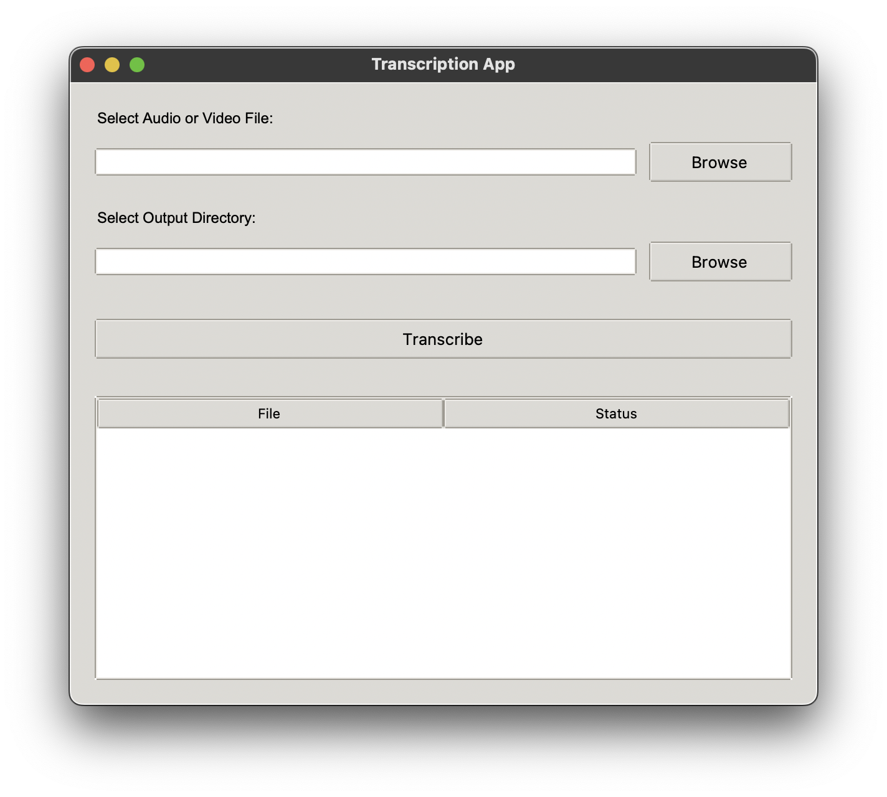

# RussianWhisperGUI

RussianWhisperGUI - это графический интерфейс для удобного использования инструмента faster-whisper для транскрипции
аудио и видео файлов на русском языке.

<p align="center">
  
</p>

## Особенности

- Простой и интуитивно понятный графический интерфейс
- Поддержка различных форматов аудио и видео файлов
- Использование модели faster-whisper для быстрой и точной транскрипции
- Оптимизировано для русского языка

## Требования

- Python 3.7+
- tkinter (обычно поставляется с Python)
- faster-whisper (должен быть установлен и доступен в системном PATH)

## Установка

1. Клонируйте репозиторий:
   ```
   git clone
   cd RussianWhisperGUI
   ```

2. Установите зависимости:
   ```
   pip install -r requirements.txt
   ```

3. Убедитесь, что faster-whisper установлен и доступен в системном PATH.

## Использование

1. Запустите приложение:
   ```
   python src/main.py
   ```

2. Нажмите кнопку "Browse" и выберите аудио или видео файл для транскрипции.

3. Нажмите кнопку "Confirm" для начала процесса транскрипции.

4. После завершения транскрипции, результат будет сохранён в текстовый файл в той же директории, что и исходный файл.
